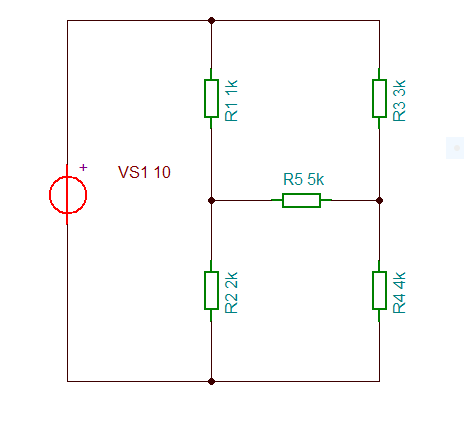

# Második Projektem

[Vissza](https://juhaszadi.github.io/portfolio/)

### Hídkapcsolás
#### Kiegyenlítettlen hídkapcsolás kimeneti feszültségének meghatározása

##### Kapcsolásirajz (TINA)

##### Szimulációs mérés eredménye (TINA)

#### Valós mérés (Laborban)

### Alkatrészjegyzék

| Alkatrész |Típus|db|
|-----------|-----|--|
|Ellenállás |     | 5|
|Áram forrás|     | 1|
|Volt mérő  |     | 1|

### Értékeik:

| Alkatrész |Típus|db|
|-----------|-----|--|
|Ellenállás |   R1|1k|
|           |   R2|2k|
|           |   R3|3k|
|           |   R4|4k|
|           |   R5|5k|

## Az áramkör összeállítása

## A mérés előkészítése, mérés

## Számítások

# Önreflexió
