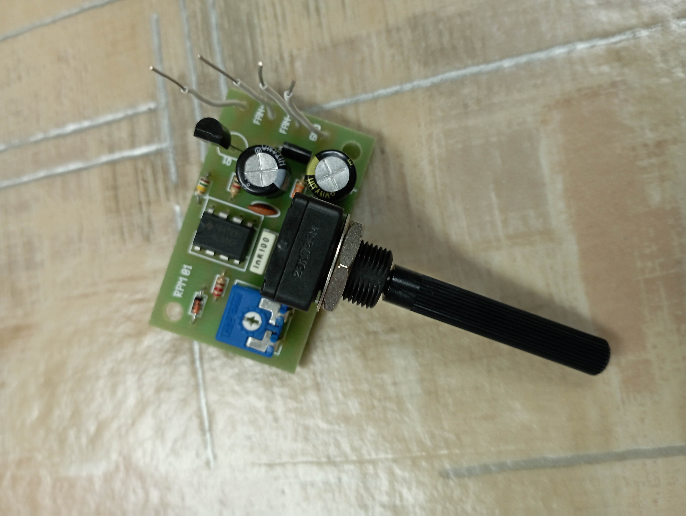

# Első Projektem

[Vissza](https://juhaszadi.github.io/portfolio/)

### Potméter

| Alkatrész |Típus|db|
|-----------|-----|--|
|Ellenállás | --- | 4|
|Dióda      |-----| 1|
|Potméter   |-----| 1|
|Trimmer PM.|-----| 1|
|Tranzisztor|-----| 3|
|IC         |-----| 1|
